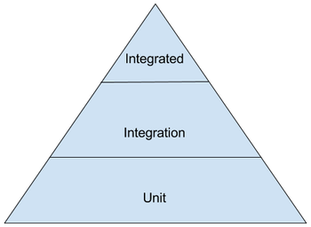

## is unit testing dead?

<small>Created by [Alvaro](http://kanekotic.xom) ([@kanekotic](http://twitter.com/kanekotic) ) @[Thoughtworks](thoughtworks). For [XConfUnplugged Madrid](https://www.meetup.com/ThoughtWorks-Madrid/events/260566714/)
</small>

---

### history behind

---

### what is unit testing?

_In computer programming, unit testing is a software testing method by which isolated units of source code are tested to determine whether they are fit for use._
<!-- .element: class="fragment fade-in plain" -->

---

### how do we expect testing to looks like?

  <!-- .element: class="fragment fade-in plain" -->

---

### Help aliens get back home after holidays

   <!-- .element: class="plain" -->

---

### Their first concern is the cost of calling a space cab

\begin{aligned}
call_{anywhere}= distance  * 0.03 \\
\end{aligned}
 <!-- .element: class="fragment fade-in plain" -->

\begin{aligned}
call_{home}= distance  * 0.03 / 0.2 \\
\end{aligned}
 <!-- .element: class="fragment fade-in plain" -->

---

### Test Inputs

--

### Brain power

```ts
test("call using normal cost", () => {
  expect(cost(1000, false)).toBe(30)
});

test("call home with reduced cost", () => {
  expect(cost(1000, true)).toBe(6)
});
```
<!-- .element style="font-size:0.5em;"-->

--

### Is this a good set of inputs?

```ts
export function cost(distance: number, isHome: boolean): number {
  return(isHome ? 6 : 30);
}
```
 <!-- .element: class="fragment fade-in plain" -->

--

### What is the problem?

 - Test does not express intentions
 <!-- .element: class="fragment fade-in plain" -->
 - Code is done with a preconception
 <!-- .element: class="fragment fade-in plain" -->

--

### Fakers

```ts
test("call using normal cost", () => {
  const distance = faker.random.number(1000);
  const result = distance * 0.03;
  expect(cost(distance, false)).toBe(result);
});

test("call home with reduced cost", () => {
  const distance = faker.random.number(1000);
  const result = distance * 0.03 * 0.2;
  expect(cost(distance, true)).toBe(result);
});
```
<!-- .element class="fragment fade-in plain" style="font-size:0.5em;"-->

---

### Test Definitions

--

### The classic

```ts
test("call home with reduced cost", () => {
  const distance = faker.random.number(1000);
  const isHome = true;
  const result = distance * 0.03 * 0.2;
  expect(cost(distance, isHome)).toBe(result);
});
```
<!-- .element style="font-size:0.5em;"-->

--

### What is the problem?

 - Arrange, Act & Assert are in the same portion of code
 <!-- .element: class="fragment fade-in plain" -->
 - Multiple assertions per test, or duplication in tests
 <!-- .element: class="fragment fade-in plain" -->

--

### Describe/It 

```ts
describe("call", () => {
  const distance : number = faker.random.number();
  let isHome : boolean

  describe("home", () => {
    let result: number;
    let expected: number;

    beforeAll(() => {
      isHome = true;
      expected = distance * 0.03 * 0.2;
      result = cost(distance, isHome);
    });

    it(`should apply discount`, () => {
      expect(result).toBe(expected);
    });
  });
  //...
});
```
 <!-- .element class="fragment fade-in plain" style="font-size:0.45em;"-->

---

### Their second concern is how to call home

Ask a friend because they do not have signal
 <!-- .element: class="fragment fade-in plain" -->

--

```ts
interface Extraterrestrial {
    callHome()
} 

class Friends {
    constructor(alien: Extraterrestrial){
        super()
        this.alien = alien
    }

    letPhone(){
        this.alien.callHome()
    }
}
```
<!-- .element style="font-size:0.4em;"-->

---

### Mock & Stubs

--

### Do it yourself

- simple stubs, complex spy or mock
 <!-- .element: class="fragment fade-in plain" -->
- multiple implementations, no setup
 <!-- .element: class="fragment fade-in plain" -->

--

```ts
describe("alien calls using friend phone", () => {
  it("works because someone answers", () => {
    class mockExtraterrestrialFail extends Extraterrestrial {
        callHome(){
        }
    }
    const result = new Friend(new mockExtraterrestrialFail())
    expect(result.letPhone()).toEqual()
  });

  it("fails because nobody answers", () => {
    class mockExtraterrestrialFail extends Extraterrestrial {
        callHome(){
            throw("nobody answering")
        }
    }
    const result = new Friend(new mockExtraterrestrialFail())
    expect(result.letPhone()).toThrow("nobody answering")
  });
});
```
<!-- .element style="font-size:0.4em;"-->

--

### Mocking frameworks

- integrated spy, mocks and stubs
- easy to setup
- no implementation, multiple setups

--

```ts
describe("alien calls using friend", () => {
  let mockAlien: any;

  beforeAll(async () => {
    mockAlien = jest.fn(() => ({
      callHome: jest.fn()
    }))();
  });

  it("works because someone answers", () => {
    const result = new Friend(mockAlien);
    expect(result.letPhone()).toEqual(undefined);
  });

  it("fails because nobody answers", () => {
    mockAlien.callHome.mockImplementation(() => {
      throw "nobody answering";
    });
    const result = new Friend(mockAlien);
    try {
      result.letPhone()
    } catch (error) {
      expect(error).toEqual("nobody answering");
    }
  });
});
```
<!-- .element style="font-size:0.3em;"-->

---

### Their third concern is remembering his home phone

needs to find it in his phonebook
 <!-- .element: class="fragment fade-in plain" -->

---

### In memory databases

- no need to setup a real database  <!-- .element: class="fragment fade-in plain" -->
- multiple options depending language  <!-- .element: class="fragment fade-in plain" -->
- downside, you need to make sure query sintax is compatible <!-- .element: class="fragment fade-in plain" -->

--

```ts  
describe("Phonebook", () => {
  let db: any;
  const expectedName = faker.random.uuid();
  const expectedNumber = faker.random.number(100000);

  beforeAll(async () => {
    db = new sqlite3.Database(":memory:");
    await new Promise((resolve, reject) =>
      db.run("CREATE TABLE phones (name TEXT, phone TEXT)", () => resolve())
    );
    var stmt = db.prepare("INSERT INTO phones VALUES (?,?)");
    stmt.run(expectedName,expectedNumber);
    
    await new Promise((resolve, reject) => stmt.finalize(() => resolve()));
  });

  afterAll(async () => {
    db.close();
  });

  it(`should return exisiting user`, async () => {
    const phonebook = new Phonebook(":memory:")
    const cabNumber = await phonebook.getPhoneNumber(expectedName)
    expect(cabNumber).toEqual(expectedNumber);
  });
});
``` 
<!-- .element style="font-size:0.3em;"-->

---

### Docker

--

### Testcontainers

- Use any container functionality (ex. db, service) <!-- .element: class="fragment fade-in plain" -->
- Manage the container lifecicle and state from the test  <!-- .element: class="fragment fade-in plain" -->

--

```ts
describe("Phonebook", () => {
  let container
  let redisClient
  const expectedName = faker.random.uuid()
  const expectedNumber = faker.random.number(100000)
  
  beforeAll( async () => {
    container = await new GenericContainer("redis","alpine")
    .withExposedPorts(6379)
    .start();
    redisClient = redis.createClient(`redis://localhost:${container.getMappedPort(6379)}`);
    await redisClient.set(expectedName, expectedNumber);
  });

  afterAll( async () => {
    await redisClient.quit();
    await container.stop();
  });

  it(`should return exisiting phone number`, async () => {
    const phonebook = new Phonebook(`redis://localhost:${container.getMappedPort(6379)}`)
    const result = await phonebook.getPhoneNumber("pepe")
    expect(cabNumber).toEqual(expectedNumber);
  });
});
```
<!-- .element style="font-size:0.35em;"-->

---

### Their last concern is to know if the phone is compatible

it needs to integrate with external network
 <!-- .element: class="fragment fade-in plain" -->

---

### Fakes over the wire

--

### Mountebank

- Allows you to fake services you interact with  <!-- .element: class="fragment fade-in plain" -->
- setup can be done manually or recorded  <!-- .element: class="fragment fade-in plain" -->

--

```json
{
    "imposters": [
        {
            "port": 4547,
            "protocol": "http",
            "stubs": [
                {
                    "responses": [
                        {
                            "is": {
                                "statusCode": 200,
                                "body": {
                                    "calling":"space cab s.a."
                                }
                            }
                        }
                    ],
                    "predicates": [
                        {
                            "exists": {
                                "method" : "GET",
                                "path" : "/call/12345"
                            }
                        }
                    ]
                }
            ]
        }
    ]
}
```
<!-- .element style="font-size:0.3em;"-->

--

```ts
describe("when service is up", () => {
  let phone: Phone;

  beforeAll(() => {
    phone = new Phone("http://localhost:4547");
  });

  it(`should show whom you are calling`, async () => {
    expect(await phone.call(12345)).toEqual({
      calling: "space cab s.a."
    });
  });
});
```

---

### How testing will really look like?

   <!-- .element: class="fragment fade-in plain" -->

---

_Unit testing is dead, long live development testing_

_It's all about diversity, learn from it :)_ <!-- .element: class="fragment fade-in plain" -->

---

### Thanks :) 

<small>Github: [@kanekotic](http://github.com/kanekotic)</small>

<small>Twitter: [@kanekotic](http://twitter.com/kanekotic)</small>

<small>Show me the code!: [https://github.com/kanekotic/is-unit-testing-dead](https://github.com/kanekotic/is-unit-testing-dead)</small>


