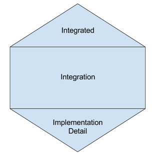

## is unit testing dead?

<small>Created by [Alvaro](http://kanekotic.xom) / [@kanekotic](http://twitter.com/kanekotic)</small>


---

### what is unit testing?

_In computer programming, unit testing is a software testing method by which individual units of source code, sets of one or more computer program modules together with associated control data, usage procedures, and operating procedures, are tested to determine whether they are fit for use._
<!-- .element: class="fragment fade-in plain" -->

---

### how do we think unit testing looks like?

  <!-- .element: class="fragment fade-in plain" -->

---

<!-- .slide: data-background="./resources/alien.jpg" -->
### Help an alien get back home 

---

### Alien first concern is the cost of is call

0.03/minute, nevertheless if its his home has a discount of 0.2
 <!-- .element: class="fragment fade-in plain" -->

---

### Test Inputs

--

### Brain power

```ts
test("if its home apply discount", () => {
  expect(cost(1000, true)).toBe(6)
});

test("if its not home dont apply discount", () => {
  expect(cost(1000, false)).toBe(30)
});
```
<!-- .element style="font-size:0.5em;"-->
<aside class="notes">
Exactly what you want and expect</aside>

--

### Is this a good set of inputs?
```ts
export function cost(distance: number, isHome: boolean): number {
  return(isHome ? 6 : 30);
}
```
 <!-- .element: class="fragment fade-in plain" -->

--

### Fakers

```ts
test("if its home apply discount", () => {
  const distance = faker.random.number(1000);
  const result = distance * 0.03 * 0.2;
  expect(cost(distance, true)).toBe(result);
});

test("if its not home dont apply discount", () => {
  const distance = faker.random.number(1000);
  const result = distance * 0.03;
  expect(cost(distance, false)).toBe(result);
});
```
<!-- .element style="font-size:0.5em;"-->
<aside class="notes">
Not what you want but what you expect</aside>

---

### Test Definitions

--

### The classical

```ts
test("if its home apply discount", () => {
  const distance = faker.random.number(1000);
  const result = distance * 0.03 * 0.2;
  expect(cost(distance, true)).toBe(result);
});
```
<!-- .element style="font-size:0.5em;"-->

<aside class="notes">each tests follows the AAA pattern and more than one assertion is done in each test. What makes it more difficult to understand the specific failure</aside>

--

### The Describe/It pattern 

```ts
describe("cost", () => {
  let result: number;
  let expected: number;

  beforeAll(() => {
    const distance = faker.random.number();
    expected = distance * 0.03 * 0.2;
    result = cost(distance, true);
  });

  it(`should apply discount`, () => {
    expect(result).toBe(expected);
  });
});
```
 <!-- .element style="font-size:0.5em;"-->
<aside class="notes">we can generate multiple levels of definitions to our tests and focus on one assertion at the time, that will allow us to know what is the exact case that makes a functionality fail</aside>

---

### Alien second concern is how to call home

he will ask a friend because he does not have money
 <!-- .element: class="fragment fade-in plain" -->

--

```ts
interface Extraterrestrial {
    callHome()
} 

class Friends {
    constructor(alien: Extraterrestrial){
        super()
        this.alien = alien
    }

    letPhone(){
        this.alien.callHome()
    }
}
```
<!-- .element style="font-size:0.4em;"-->
<aside class="notes"></aside>

---

### Mock & Stubs

--

### Do it yourself

- simple stubs, complex spy or mock
- multiple implementations, no setup

--

```ts
describe("alien calls using friend", () => {
  it("works because someone answers", () => {
    class mockExtraterrestrialFail extends Extraterrestrial {
        callHome(){
        }
    }
    const result = new Friend(new mockExtraterrestrialFail())
    expect(result.letPhone()).toEqual()
  });

  it("fails because nobody answers", () => {
    class mockExtraterrestrialFail extends Extraterrestrial {
        callHome(){
            throw("nobody answering")
        }
    }
    const result = new Friend(new mockExtraterrestrialFail())
    expect(result.letPhone()).toThrow("nobody answering")
  });
});
```
<!-- .element style="font-size:0.4em;"-->
<aside class="notes"></aside>

--

### Mocking frameworks

- integrated spy, mocks and stubs
- easy to setup
- no implementation, multiple setups

--

```ts
describe("alien calls using friend", () => {
  let mockAlien: any;

  beforeAll(async () => {
    mockAlien = jest.fn(() => ({
      callHome: jest.fn()
    }))();
  });

  it("works because someone answers", () => {
    const result = new Friend(mockAlien);
    expect(result.letPhone()).toEqual(undefined);
  });

  it("fails because nobody answers", () => {
    mockAlien.callHome.mockImplementation(() => {
      throw "nobody answering";
    });
    const result = new Friend(mockAlien);
    try {
      result.letPhone()
    } catch (error) {
      expect(error).toEqual("nobody answering");
    }
  });
});
```
<!-- .element style="font-size:0.4em;"-->
<aside class="notes"></aside>

---

### Alien third concern is remembering his home phone

needs to find it in his phonebook
 <!-- .element: class="fragment fade-in plain" -->

---

### In memory databases

- no need to setup a real database  <!-- .element: class="fragment fade-in plain" -->
- multiple options depending language  <!-- .element: class="fragment fade-in plain" -->
- downside, you need to make sure query sintax is compatible <!-- .element: class="fragment fade-in plain" -->

--

```ts  
describe("in memory db", () => {
  let db: any;

  beforeAll(async () => {
    db = new sqlite3.Database(":memory:");
    await new Promise((resolve, reject) =>
      db.run("CREATE TABLE phones (name TEXT, phone TEXT)", () => resolve())
    );
    var stmt = db.prepare("INSERT INTO phones VALUES (?,?)");
    stmt.run("Home","123456");
    
    await new Promise((resolve, reject) => stmt.finalize(() => resolve()));
  });

  afterAll(async () => {
    db.close();
  });

  it(`should return exisiting user`, async () => {
    await new Promise((resolve, reject) =>
      db.each(
        "SELECT * FROM lorem where name = 'Home'",
        function(_: any, row: any) {
          expect(row.phone).toEqual("123456");
        },
        () => resolve()
      )
    );
  });
});
``` 
<!-- .element style="font-size:0.3em;"-->

---

### Docker

--

### Testcontainers

--

```ts
describe("DAL", () => {
  let container
  let redisClient
  
  beforeAll( async () => {
    container = await new GenericContainer("redis","alpine")
    .withExposedPorts(6379)
    .start();
    redisClient = redis.createClient(`redis://localhost:${container.getMappedPort(6379)}`);
    await redisClient.set("pepe", "is awesome");
  });

  afterAll( async () => {
    await redisClient.quit();
    await container.stop();
  });

  it(`should return exisiting user`, async () => {
    const dal = new DAL()
    await dal.connect(`redis://localhost:${container.getMappedPort(6379)}`)
    const result = await dal.getUser("pepe")
    expect(result).toEqual("is awesome")
  });
});
```
<!-- .element style="font-size:0.4em;"-->

---

### Alien last concern is will the phone work

it needs to integrate with other systems
 <!-- .element: class="fragment fade-in plain" -->

---

### Mountebank   

---

### How testing will really look like?

   <!-- .element: class="fragment fade-in plain" -->

---

_Unit testing is dead, long live unit testing_

---

   <!-- .element: class="plain" -->


